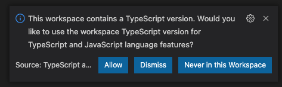
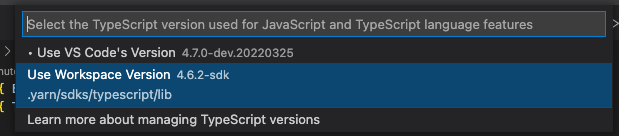

## BoilerPlate

### TechStack

### 요약

위 기술 스택 기반으로 구성한 프로젝트 보일러플레이트입니다.

Yarn berry의 Zero-Installs 방법을 사용했습니다. VSCode환경 기준으로 작성했습니다.

관련해서 VSCode Extension인 zipfs 설치와 VSCode의 TypeScript 버전 선택이 필요합니다.

방법은 아래에 간단하게 작성했습니다.

1. zipfs 설치

[https://marketplace.visualstudio.com/items?itemName=arcanis.vscode-zipfs](https://marketplace.visualstudio.com/items?itemName=arcanis.vscode-zipfs)

2. workspace 버전 선택

- 처음 VSCode 실행 시 다음과 같은 알람 메세지가 뜹니다. Allow 를 클릭해주세요.

- 만약 알람 메세지가 뜨지않는다면 맥북 기준 `command + shift + p` 클릭 후 >TypeScript: Select TypeScript Version 을 입력해주세요. 이후에 Workspace 버전을 선택해주시면 됩니다!

